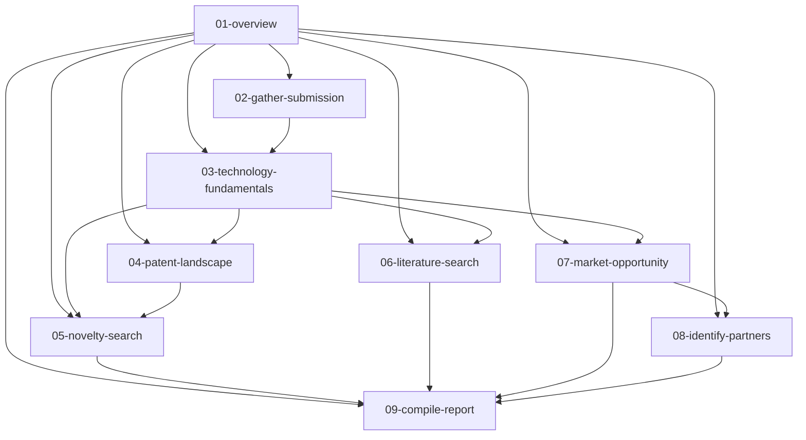

# Index — Invention Evaluation Skill Framework

## Dependency graph

## Dependency types

| Type | Definition | Example |
|---|---|---|
| **Hard** | Cannot execute without this artifact | Novelty search requires a claim representation |
| **Soft** | Can execute with degraded capability | Market analysis works without a full landscape |

## Dependency map

| Skill | Hard dependencies | Soft dependencies |
|---|---|---|
| 01-overview | None | None |
| 02-gather-submission | None | None |
| 03-technology-fundamentals | Submission record | Domain familiarity |
| 04-patent-landscape | Technology profile (description + classification) | None |
| 05-novelty-search | Claim representation (from Skill 05's own construction or supplied) | Technology profile, landscape output |
| 06-literature-search | Technology profile | None |
| 07-market-opportunity | Technology profile | Patent landscape, competitive IP posture |
| 08-identify-partners | Market opportunity output | None |
| 09-compile-report | All upstream outputs | None |

## Entry points

| Situation | Start at |
|---|---|
| Cold start, nothing captured yet | `01-invention-evaluation-overview` |
| Submission already in hand | `02-gather-invention-submission` |
| Standalone market check | `07-analyze-market-opportunity` |
| Standalone patentability check | `03-analyze-technology-fundamentals` → `05-conduct-novelty-search` |
| FTO / infringement question | Do not enter this pipeline. Explain the FTO/novelty distinction (see GLOSSARY.md) and scope it as a separate engagement with counsel. |

## Highest-frequency skills in practice

`03-analyze-technology-fundamentals`, `05-conduct-novelty-search`, `07-analyze-market-opportunity` — most requests touch at least one of these directly, independent of the full pipeline.

## Structural note on this version

**Version: v1.5** — All skills include explicit **decision gates** (anticipation, obviousness with the Causal Bridge Test and motivation-object/expected-success/mechanism-distance/design-choice-distance gates, unexpected result) and **evidence-state discipline** (CONFIRMED PRESENT / CONFIRMED ABSENT / NOT OBSERVED / NOT IDENTIFIED / NOT EVALUATED / INFERRED / CONTESTED), plus an **Evidence → Inference → Conclusion firewall** that prevents any downstream stage from promoting an inference into a fact. v1.5 adds: mechanism distance (C0–C4) + orthogonal design-choice distance (D0–D4, never combined); the **Negative Evidence Coverage Rule** (coverage object mandatory on all negative findings; coverage never changes evidence state; CONFIRMED ABSENT requires a bounded universe); the **Motivation Object** (categorized source lists, deterministic GROUNDED/PARTIALLY GROUNDED/INFERRED/RECONCILIATION REQUIRED derivation); the **knowledge decomposition** (component/principle/function/combination/application, evidence-stated); the **Causal Bridge Test** (bridge_status TRAVERSED/UNTRAVERSED/UNRESOLVED) as the centerpiece of obviousness analysis; and removal of the "overall patentability" row from the default conclusion (executive score derived only on request). The framework is an evidence-constrained invention reasoning engine, not a collection of research prompts.
