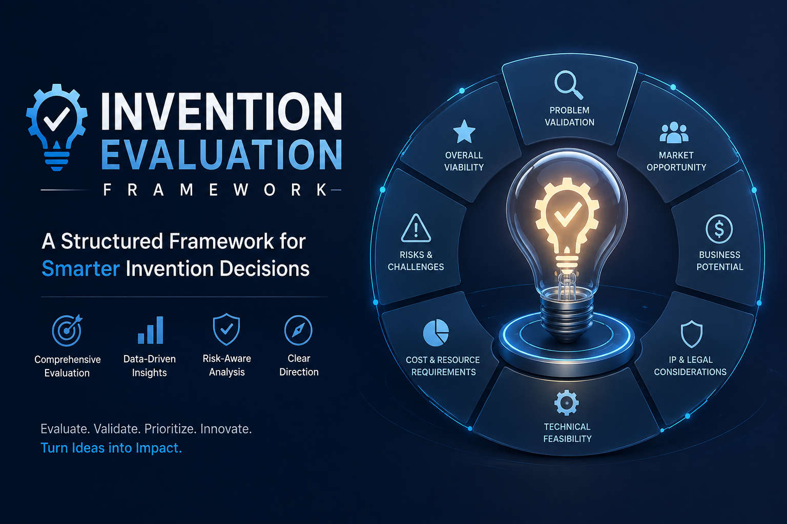

# Invention Evaluation Framework

> **Evidence-governed multi-agent intelligence for evaluating inventions, patents, technology, intellectual property, commercialization potential, and market opportunity.**

[](https://github.com/Michaelrobins938/invention-evaluation-framework/actions/workflows/ci.yml)


[](LICENSE)
[](#)
[](#)
[](#)



Most AI evaluation pipelines produce confident conclusions from unverifiable reasoning.
The Invention Evaluation Framework takes the opposite stance: **an invention assessment may
only state what its gathered evidence actually supports**. A multi-agent engine decomposes an
invention into propositions, dispatches research workers against live patent and literature
sources (EPO OPS, Crossref), classifies every artifact as external or derived evidence, and
routes each conclusion through independent review and blind fresh verification before anything
reaches the reader.

## See It Work (30 seconds)

Real artifacts from a complete evaluation of US8527057B2 — every number in the report traces
to a logged execution:

| Artifact | What it shows |
|----------|---------------|
| [Rendered report (PDF, 29 pages)](evaluations/us8527057-v17%28Complete-pass%29/report-us8527057-v17.pdf) | Consumer-facing deliverable: recommendation, confidence, limitations |
| [Execution ledger](evaluations/us8527057-v17%28Complete-pass%29/execution-ledger.json) | Every live retrieval executed, timestamped, with result counts |
| [Report source (Markdown)](evaluations/us8527057-v17%28Complete-pass%29/report-us8527057-v17.md) | Same report, auditable text form |

Full artifact sets for additional inventions (including deliberately failed runs) live in [`evaluations/`](evaluations/).

## Quick Start

### One-click setup

```bash
# 1. Clone
git clone https://github.com/Michaelrobins938/invention-evaluation-framework
cd invention-evaluation-framework

# 2. Run setup — installs dependencies, detects your coding agent,
#    and installs the evaluation skill into it automatically
bash setup.sh
```

Windows (PowerShell):

```powershell
powershell -ExecutionPolicy Bypass -File setup.ps1
```

Setup does everything:
- Verifies Python 3.10+ and pip
- Installs all Python dependencies (`requirements.txt`)
- Detects installed coding agents (Claude Code, OpenCode) and installs the `run-invention-evaluation` skill into each, with the framework path baked in
- Creates `.env` from template (add EPO OPS credentials later for live patent search)
- Runs a smoke test so you know it works

### Evaluate an invention (one command)

```bash
./evaluate /path/to/your-invention-folder
```

Or just tell your coding agent:

> evaluate this invention folder: /path/to/folder

Optional arguments:
- `--id US8527057` — specify the patent/invention ID manually (auto-detected from filenames/folder name if omitted)
- `--output ./my-results` — custom output directory

The script scans the folder for PDFs/DOCX/TXT/MD, auto-detects the invention ID, extracts text, creates a submission record, and runs the full pipeline. Without API credentials, patent-search lanes run without live data and report evidence debt — a valid result, never mocked.

### What `run.py` does

```
Folder of documents
    ↓  scan for PDFs, DOCX, TXT, MD
    ↓  auto-detect invention ID from filenames/folder name
    ↓  extract text from documents
    ↓  create submission-*.md record
    ↓  set up evaluations/{id}/ directory
    ↓  run full IEF pipeline (E0-E9, review, verification, report)
    ↓
Output: evaluations/{id}-output/
    report-*.md / .html / .pdf
    execution-ledger.json
    combined-status.json
    ... (29 artifacts)
```

### Advanced: Python API

```python
from pathlib import Path
from engine_v17.orchestrator_autoprompt import run_with_autoprompt

result = run_with_autoprompt(
    'US8527057', 'evaluations/us8527057/source/US8527057.pdf',
    Path('evaluations/us8527057-output'), Path('evaluations/us8527057'),
    execution_mode='REAL_AUTOPROMPT',
    epistemic_mode='FULL_CONTROLLER',
    review_mode='INDEPENDENT',
    verification_mode='BLIND_FRESH',
)
```

### Run tests (281 total)

```bash
python3 -m pytest engine_v17/epo_ops/tests -q               # 66 EPO OPS
python3 -m pytest tests -q                                   # 38 integration/failure
python3 -m pytest Test-report-results/tests_v17 -q           # 114 v17 engine
python3 -m pytest report-renderer/tests -q                   # 63 renderer
bash verify.sh  # includes semantic scan note: see docs/ARCHITECTURE.md#validation
```

### Configure live patent search (optional)

```bash
cp .env.example .env   # paste EPO OPS credentials from https://developers.epo.org
python -m engine_v17.epo_ops   # verify credentials work
```

Without credentials, patent search lanes produce evidence debt artifacts (valid result, not a failure).

---

---

## What This Is

The system does not merely ask an LLM to write an evaluation.

It **decomposes an invention into propositions, dispatches specialized research workers, gathers and classifies evidence, evaluates evidence sufficiency, performs independent review and blind fresh verification, and generates an auditable decision-support report.**

```
Input                              Processing                          Output
─────────────────  ───────────────────────────────────────────  ───────────────────────────
invention          extraction → claim decomposition →         evidence-traceable
patent             proposition generation → research →         invention evaluation
technical          evidence collection → sufficiency →        with explicit uncertainty
submission         rights / prior-art / market analysis →     and evidence debt
                   review → verification → arbitration →
                   decision state → report
```

> **The system can say "we don't know" without treating that as a failure.**

Evidence insufficiency is a valid result:

```text
Evidence insufficient
        ↓
E3 FAILED
        ↓
WORK QUEUE / ESCALATION_REQUIRED
        ↓
No unsupported conclusion
```

That is epistemic containment, not failure.

### What happens when I submit an invention?

```
INPUT: invention / patent / technical submission
  ↓
1. understand the submission (disclosure dates captured, even if "none")
2. analyze the technology (feature→benefit, IPC/CPC candidates, regulatory)
3. search prior art / literature (patent landscape, literature, novelty claim mapping)
4. evaluate market opportunity (bounded model, not NAICS alone)
5. identify potential partners (fit: sells/buys/need/mapping)
6. map claims/elements (deterministic claim-mapping.json, WORK QUEUE if incomplete)
7. construct evidence graph (debt + constraints downstream of propositions)
8. test propositions (E0-E9 epistemic gates, coverage gates)
9. independently review (ap-reviewer, per-proposition)
10. blind verify (ap-fresh-verifier, per-proposition, is_blind=true)
11. produce decision report (Markdown → HTML → PDF, provenance preserved)
```

The system can legitimately return:

- `Established` · `Not established` · `Insufficient evidence` · `Work Queue` · `Escalation Required` · `Search Exhausted` · `Blocked`

> **Insufficient evidence is a result, not a hallucination.**

---

## Architecture

**Autoprompt orchestrates the work. IEF governs what the evidence is allowed to establish.**

```
                         INVENTION / PATENT
                                │
                                ▼
                       EVALUATION MISSION  (mission.py, mission hash)
                                │
                                ▼
                         AUTOPROMPT
                      ORCHESTRATION LAYER  (opencode provider, 25 personas)
                                │
                ┌───────────────┼───────────────┐
                ▼               ▼               ▼
             PATENTS        LITERATURE        MARKET
             WORKERS         WORKERS          WORKERS
                │               │               │
                └───────────────┼───────────────┘
                                ▼
                       IEF EVIDENCE LAYER
                                │
                 ┌──────────────┼──────────────┐
                 ▼              ▼              ▼
             PROPOSITIONS    CLAIMS        RIGHTS
                 │              │              │
                 └──────────────┼──────────────┘
                                ▼
                            E0 → E9
                       EPISTEMIC CONTROLLER  (epistemic_gates.py)
                                │
                 ┌──────────────┴──────────────┐
                 ▼                             ▼
          INDEPENDENT REVIEW             BLIND VERIFICATION
            ap-reviewer                  ap-fresh-verifier
                 │                             │
                 └──────────────┬──────────────┘
                                ▼
                           ARBITRATION  (ap-arbiter)
                                │
                                ▼
                        DECISION / REPORT
                     Markdown · HTML · PDF
```

**Separation of responsibilities:**

| Layer | Owns |
|-------|------|
| **Autoprompt** | task decomposition, worker orchestration, parallel execution, persona dispatch, retries, collection |
| **IEF** | proposition model, evidence model, source provenance, evidence sufficiency, E0-E9, rights/claim relationships, uncertainty, review, verification, final decision state |
| **Evidence Controller** | whether evidence supports a proposition; prevents unsupported conclusions |
| **Report Renderer** | faithful, evidence-preserving presentation |

---

## Multi-Agent Execution

| IEF DAG Node | Autoprompt Persona | Phase |
|--------------|--------------------|-------|
| `gather-submission` | `ap-scribe` | 02 |
| `analyze-technology` | `ap-scoper` | 03 |
| `patent-landscape` | `ap-researcher` | 04 |
| `literature-search` | `ap-researcher` | 04 (parallel) |
| `market-opportunity` | `ap-researcher` | 06 (parallel) |
| `novelty-search` | `ap-researcher` | 05 |
| `identify-partners` | `ap-researcher` | 07 |
| `compile-report` | `ap-synthesizer` | 08 |
| `render-report` | `ap-scribe` | 09 |
| `independent review` | `ap-reviewer` | E7 |
| `fresh verification` | `ap-fresh-verifier` | E8 (blind) |
| `disagreement` | `ap-arbiter` | arbitration |

Research lanes execute according to the DAG — independent lanes dispatch in parallel where dependencies allow (`spawn-all-then-collect`, max 6 concurrent, bounded retry). The integrated path uses `REAL_AUTOPROMPT` and does **not** silently fall back to the legacy orchestrator (`LEGACY_FALLBACK` exists only as explicit compatibility/benchmark mode). No recursive orchestration: `skill: deny` + `permission.task: {"*":"deny","ap-*":"allow"}` on every persona.

---

## DAG Execution

**Launch groups** (`engine_v17/dag.py:112`):

```
GROUP 0  gather-submission
GROUP 1  analyze-technology
GROUP 2  patent-landscape · literature-search · market-opportunity  (parallel)
GROUP 3  novelty-search · identify-partners
GROUP 4  compile-report
GROUP 5  render-report
GROUP 6  independent review + fresh verification  (concurrent, blind)
GROUP 7  arbitration if disagreement
```

- `spawn-all-then-collect` within each group
- Dependency-aware (hard deps must be satisfied; soft deps may degrade)
- Bounded retries (max 2, exponential backoff, 60s timeout per `autoprompt/ief.json`)
- No recursion (single top-level authority per run)

---

## Evidence Architecture

```
External Source
      ↓
SourceObject  (source_identity + locator + execution_id + independence_lineage_id)
      ↓
Evidence Item  (typed per schemas/evidence-contract, SCHEMAS registry)
      ↓
Worker Interpretation  (ap-* persona output, not evidence)
      ↓
Proposition  (stable id + version, atomic)
      ↓
Review  (ap-reviewer, independent)
      ↓
Decision  (E0-E9 gates, premise-mapped)
```

**Crucial distinction:**

```text
SOURCE          ≠  DERIVED WORKER OUTPUT  ≠  PROVENANCE / LEDGER

patent HTML          ap-synthesizer markdown      execution-ledger.json
Crossref JSON        ap-scribe HTML               review-ledger.json
WorldBank JSON       claim-mapping synthesis      run-manifest.json
EPO OPS bundle       scores synthesis             combined-status.json
```

`E1` counts **external/primary sources** (7 in the US8527057 validation run), not derived artifacts (3 `ap-synthesizer`/`ap-scribe`/ledger not counted). This prevents fake source diversity.

---

## E0–E9 Epistemic Gates

From `engine_v17/epistemic_gates.py:49`:

| Gate | Name | Question | Blocks |
|------|------|----------|--------|
| **E0** | Intake validity | Can we establish what is being evaluated? | submission missing |
| **E1** | Source integrity | Are external sources valid, readable, correctly identified, complete? | source_unavailable / insufficient_identity |
| **E2** | Proposition integrity | Have material conclusions been decomposed into atomic propositions with stable IDs? | scope_mismatch / duplicate IDs |
| **E3** | Evidence sufficiency | Does each proposition pass the Sufficiency Gate (SCHEMAS + corroboration)? | insufficient_corroboration |
| **E4** | Temporal validity | Is evidence valid for the relevant date/time (critical date)? | insufficient_temporal_match |
| **E5** | Contradiction check | Is conflicting evidence reconciled? | unresolved_conflict |
| **E6** | Analytical validity | Does conclusion follow from evidence (premise-mapped, no orphan)? | orphan conclusion / work-state premise |
| **E7** | Independent review | Can an independent reviewer reproduce/validate? | review blocked/failed |
| **E8** | Fresh verification | Can a blind fresh verifier independently validate? | verification blocked/failed |
| **E9** | Report integrity | Does report preserve evidence status, uncertainty, limitations? | missing sections / dropped nodes |

**Evidence sufficiency gate** (`engine_v17/evidence_gate.py:93`): the only path for a proposition into findings — schema-driven, atomic (`SCHEMAS`: `prior_art_disclosure`, `literature_disclosure`, `market_sizing`, `commercial_adoption`, `partner_fit`), with `independence_lineage_id` for corroboration. `E3 FAILED` does **not** mean pipeline failure — it can mean `EXECUTION COMPLETED_WITH_EVIDENCE_DEBT / EVIDENCE INSUFFICIENT`, a valid epistemic result.

---

## Evidence Debt

```text
missing evidence  ≠  negative evidence
retrieval failure ≠  evidence of absence
model confidence  ≠  evidence confidence
```

When evidence is insufficient, the system preserves:

- `WORK QUEUE` — evidence sufficiency incomplete
- `ESCALATION_REQUIRED` — avenues remain
- `SEARCH_EXHAUSTED` / `EXHAUSTED` — all avenues dispositioned, not evidence
- `UNAVAILABLE_BY_CONSTRAINT` — inherently inaccessible (e.g., confidential license terms)
- `BLOCKED` (avenue-level) — source cannot be executed

Debt becomes a structured `ap-researcher`/`ap-sweeper` task (bounded retry) or `ap-arbiter` escalation, not a hallucinated answer. `missing evidence ≠ negative evidence` is an invariant.

---

## Proposition-Level Review

Every material proposition is classified and reviewed:

- All 5 propositions in the US8527057 validation run were reviewed
- Every material proposition receives **independent review** (`ap-reviewer`) — reads evidence, not author's verdict
- Every material proposition receives **blind fresh verification** (`ap-fresh-verifier`) — re-derives without reading reviewer verdict
- Missing coverage **blocks** E7/E8 (not silently PASSED)
- Results persisted to `proposition-review-matrix.json` + `review-ledger.json`

```
Proposition Ledger (5 props)
       │
       ├── P-02-001 → reviewer → verifier → PASSED
       ├── P-05-001 → reviewer → verifier → PASSED
       ├── P-05-002 → reviewer → verifier → PASSED
       ├── P-07-001 → reviewer → verifier → PASSED
       └── P-08-001 → reviewer → verifier → PASSED
                     │
                     ▼
            Proposition Review Matrix (5 entries, criticality=critical)
                     │
                     ▼
                E7 / E8  (require all critical propositions covered)
```

**Artifacts:** `proposition-review-matrix.json` (per-proposition `reviewer_verdict`/`verifier_verdict`/`criticality`), `review-ledger.json` (10 records: 5×2, `is_blind`, `is_independent`, `evidence_refs`). No self-review: `independent_review` raises `ValueError: fake independence` if reviewer == author.

---

## Claim Mapping

Claim mapping is a **deterministic analytical contract**, not a retrieval side-effect:

```text
 _ensure_claim_mapping()
      ▲
      │
live path ──────┘
      ▲
      │
ingestion path ─┘
```

`engine_v17/workers.py:112` ensures `claim-mapping.json` is produced regardless of whether patent evidence came from live retrieval, existing artifact, or hermetic test source. Incomplete mappings remain:

```json
{"target_patent":"US8527057","target_claim":{…},"references":[],"state":"WORK QUEUE","analytical_contract":"deterministic"}
```

rather than fabricated. Retrieval method changes; analytical contract doesn't.

---

## Rights / Family Reasoning

```
target patent status  ≠  family status  ≠  portfolio status  ≠  freedom to operate
```

An expired patent does not automatically mean the technology is free of IP constraints. The framework treats patent relationships as a graph (priority → parent/CIP → continuations, `engine_v17/rights_graph.py:25`), reasoning about expired parents, active descendants, assignments (`Second Sight → Vivani 2022 → Cortigent 2023`), and surviving asset layers (`know_how`, `regulatory_assets`, `clinical_data`). Target-patent lapse blocks standalone patent licensing; family/portfolio diligence is required (see `US8527057` evaluation: `EXPIRED 2025-09-03` but `US7881799B2 ACTIVE 2028-03-14`, `US8473048B2 ACTIVE 2028-06-25`).

---

## Consumer-Friendly Reporting

Progressive disclosure:

```
Bottom Line
     ↓
What It Means
     ↓
What To Do
     ↓
Why
     ↓
Technical Detail
     ↓
Audit Trail
```

The executive reader should not need `P-03-004`, `E7`, or `evidence_graph.json` to understand the recommendation; those remain in the audit layer. Reports are evidence-governed translations, not pretty hallucinations.

---

## Validation Status

**Engineering Operational · Autoprompt Integration Complete · Evidence Controller Operational · Real Multi-Agent Execution Proven**

**Tests:** 281 passed (66 EPO OPS + 38 integration/failure + 114 v17 engine + 63 renderer)

| Suite | Count | What it proves |
|-------|-------|----------------|
| Real dispatch | 11 | `REAL_AUTOPROMPT` lanes, DAG parallel, E0-E9 real, scores provenance, E7/E8 5/5, hermetic live chain, A/B provenance, no fallback, multi-run, no recursion |
| Integration + failure modes | 27 | mission/DAG, status separation, E1-E3 gates, coverage, review independence, no recursion, 15 failure modes (unavailable, rate-limited, malformed, incomplete, contradictory, insufficient, timeout, worker failure, retry exhaustion, verifier/reviewer disagreement, unsupported conclusion, duplicate mapping, partial pipeline, report failure) |
| Existing IEF | 113 | claim graph, constraints, coverage, domain parsers, evidence gate, execution ledger, provenance |
| Renderer | 63 | contract, visual QA, lattice, contamination |

**Multi-run reliability (3× US8527057 real Autoprompt):**

```text
Run 1 → REAL_AUTOPROMPT / FULL_CONTROLLER / INDEPENDENT / BLIND_FRESH | 9 lanes | 10 reviews | INSUFFICIENT | no recursion
Run 2 → REAL_AUTOPROMPT / FULL_CONTROLLER / INDEPENDENT / BLIND_FRESH | 9 lanes | 10 reviews | INSUFFICIENT | no recursion
Run 3 → REAL_AUTOPROMPT / FULL_CONTROLLER / INDEPENDENT / BLIND_FRESH | 9 lanes | 10 reviews | INSUFFICIENT | no recursion
```

Consistent `INSUFFICIENT` is correct on this evidence-incomplete fixture — the framework correctly refuses to overclaim.

---

## Benchmark Results

**Provenance (P4 hardened):**

| Variant | Execution | Epistemic | Review | Verification | Completion | Evidence Coverage | Unsupported Inference | Overclaim |
|---------|-----------|-----------|--------|--------------|------------|-------------------|---------------------|-----------|
| **A** | LEGACY_FALLBACK | LEGACY | LEGACY | LEGACY | 0.88 | 0.20 | 0.20 | 0.20 |
| **B** | REAL_AUTOPROMPT | IEF_STANDARD | STANDARD | STANDARD | **1.00** | 0.20 | 0.20 | 0.20 |
| **C** | REAL_AUTOPROMPT | FULL_CONTROLLER | INDEPENDENT | BLIND_FRESH | **1.00** | 0.20 | 0.20 | 0.20 |

`PYTHONPATH=. python3 benchmarks/harness.py --evaluation-id US8527057 --evaluation-dir evaluations/us8527057 --output-base /tmp/bench`

**Interpretation:** Autoprompt increased completion 0.88 → 1.00 on this validation benchmark **without increasing measured unsupported inference or overclaim** (both 0.20 steady, `overclaim gate PASS`). This demonstrates improved execution completeness without epistemic regression on the tested case. Broader validation requires an expanded corpus — do not read as universal quality improvement.

---

## Overclaim Metric

```text
overclaim_rate = |{debt p: p in Established Findings with confirmed language}| / |debt|
debt = {p | p.state ∈ {escalation_required, SEARCH_EXHAUSTED, BLOCKED, EXHAUSTED}}
```

A finding that **correctly** describes evidence debt in the Operational Audit is **not** an overclaim. Previous implementation counted any mention of debt as overclaim (1.00 everywhere); corrected in `benchmarks/harness.py:56` to count only debt presented as `CONFIRMED PRESENT` in findings. **0 = no overclaim, 1 = every debt overclaimed.**

---

## Repository Map

```
invention-evaluation-framework/
├── run.py                              ONE-COMMAND CLI — point at a folder of documents
├── evaluate                            shell wrapper for run.py (./evaluate <folder>)
├── setup.sh                            one-click installer: deps + agent skill install
├── setup.ps1                           Windows installer mirror
├── requirements.txt                    Python dependencies
├── IEF_EXECUTION_CONTRACT.md          execution contract (mission lifecycle, DAG, E0-E9, status)
├── schemas/
│   ├── evaluation-mission.schema.json
│   ├── skill-contract.schema.json
│   ├── evidence-contract.schema.json
│   └── skill_registry.json            9 skills machine-readable
├── autoprompt/ief.json                IEF-for-Autoprompt config (skill paths, state, review, concurrency 6, retry 2)
├── engine_v17/
│   ├── mission.py                     EvaluationMission + hash
│   ├── dag.py                         DAG + launch groups + DAG_DIAGRAM
│   ├── status.py                      CombinedStatus(execution, evidence)
│   ├── epistemic_gates.py             E0-E9
│   ├── review.py                      independent_review / fresh_verification / arbitrate
│   ├── workers.py                     9 DAG workers + _ensure_claim_mapping (P3)
│   ├── hermetic_fetcher.py            4-type mocked source payloads
│   ├── pdf_parser.py                  PDF/DOCX/TXT/MD text extraction (for run.py)
│   ├── orchestrator.py                legacy run / run_generic (preserved)
│   └── orchestrator_autoprompt.py     REAL dispatch (spawn-all-then-collect, E7/E8 5/5, provenance 4-tuple)
├── skills/
│   ├── SKILL-Orchestrator.md          domain-policy router (Autoprompt is execution, IEF is policy)
│   ├── skill-02-gather-invention-submission/
│   ├── skill-03-analyze-technology-fundamentals/  … up to skill-10-render-report
│   ├── DIGEST.md · GLOSSARY.md · INDEX.md · PIPELINE_STATE.md
│   └── superpowers/                   sdd/ harness tasks
├── benchmarks/harness.py              A/B/C harness (14 metrics, 4-mode provenance)
├── tests/
│   ├── test_real_dispatch.py          11 real-dispatch tests (P1-P4)
│   ├── test_autoprompt_integration.py 11 integration tests
│   └── test_failure_modes.py          15 failure-mode tests
├── report-renderer/
│   ├── render_report.py · contract.py · visual_qa.py · template.html
│   └── tests/
├── evaluations/
│   ├── us8527057/                     US 8,527,057 (validation case, 9 lanes, 5/5 reviews)
│   ├── 7149534/ · 7153242/ · 8905955/  additional cases
│   └── us8527057-v17(Complete-pass)/  legacy fixture
├── docs/
│   ├── ARCHITECTURE.md                detailed execution model
│   ├── INTEGRATION-AUTOPROMPT.md      Phase 1-3 integration report
│   └── GLOSSARY.md                    terminology (Autoprompt, E0-E9, REAL_AUTOPROMPT, etc.)
├── CHANGELOG.md                       Phase 3 Hardening entry
├── verify.sh                          install verifier (pre-existing semantic scan note see P5)
├── .gitignore                         .ief-runs/, PROMPTS.txt, ROADMAP.md, GATELOG.md, .autoprompt/
└── Assets/invention-evaluation-cover.png
```


---

## Evaluation Output Artifacts

| Artifact | Represents |
|----------|------------|
| `evaluation-mission.json` | Typed mission + hash + bytes + nonce (immutable) |
| `execution-plan.json` | DAG nodes, edges, topological order, launch groups, diagram |
| `run-manifest.json` | Unified ledger: mission, plan, `execution_mode`, `epistemic_mode`, `review_mode`, `verification_mode`, `lane_dispatch_log`, `all_lanes_real`, gates, combined status |
| `execution-ledger.json` | Per-lane `ExecutionRecord` (phase, persona, `source_type`, `result_artifact`, `evidence_sufficiency`) |
| `proposition-ledger.json` | 5 propositions with `state`, `epistemic_state`, `recovery_state`, `blockers` |
| `evidence-graph.json` | Evidence debt + constraints downstream of propositions |
| `claim-graph.json` | Claim domains (retinal, mechanical, packaging, interconnect, power) |
| `rights-graph.json` | Patent family, status (`EXPIRED` vs surviving `ACTIVE`), assignments |
| `claim-mapping.json` | Target claim vs references, `state WORK QUEUE`, deterministic contract |
| `epistemic-gate-report.json` | E0-E9 verdicts + basis + barrier_type |
| `proposition-review-matrix.json` | Per-proposition `criticality`, `reviewer_verdict`, `verifier_verdict` |
| `review-ledger.json` | 10 review records (`is_blind`, `is_independent`, `evidence_refs`) + arbitrations |
| `combined-status.json` | `CombinedStatus(execution, evidence)` — never collapsed to SUCCESS |
| `coverage-report.json` | Coverage gate results + blocking gates |
| `scores-manifest.json` | `target_patent`, `evidence_items`, `gauges` (basis `proposition_id`) |
| `report-*.md` / `.html` / `.pdf` | Compiled report + styled deliverable (TOC accurate, footer, watermark) |

Not every evaluation contains every artifact unless the code guarantees it — missing evidence yields `WORK QUEUE`/`ESCALATION_REQUIRED`, not fabricated files.

---

## What This Is Not

This framework provides automated research and analytical **decision support**. It does **not** constitute:

- legal advice · patent prosecution advice · patent validity opinion · infringement opinion · freedom-to-operate opinion · investment advice · medical advice · regulatory advice · valuation certification

Patent status, ownership, licensing, infringement, validity, and enforceability should be independently verified by qualified professionals where material decisions depend on them.

It is **evidence-based decision support**. An `INSUFFICIENT` result is a successful epistemic outcome — the system refusing to overclaim.

---

## Project Status

**Engineering Operational · Evidence-Governed Evaluation Pipeline · Validation In Progress**

Individual evaluations may remain evidence-incomplete — that is the framework working correctly, not a product defect.

| Dimension | Status |
|-----------|--------|
| Engineering | Operational |
| Autoprompt Integration | Complete (REAL dispatch proven, no fallback, no recursion) |
| Epistemic Controller | Operational (E0-E9, 5/5 review matrix, blind verification) |
| Real Multi-Agent Execution | Proven (9 DAG worker lanes + 3 review/verification lanes = 12 active personas; 25 installed Ap personas; 5/5 propositions reviewed) |
| Validation Corpus | Expanding |
| Overall Product | Research / Decision-Support Platform (not a finished commercial due-diligence product) |
| Evaluation Status | May be `COMPLETE`, `COMPLETED_WITH_EVIDENCE_DEBT`, `INSUFFICIENT`, `BLOCKED`, or `PARTIAL` — `COMPLETED_WITH_EVIDENCE_DEBT` is success with debt, not failure |

### Known Limitations (evidence-governed honesty)

| Layer | Status |
|-------|--------|
| Autoprompt integration | **Operational** |
| Real multi-agent execution | **Proven** (9 DAG lanes, `spawn-all-then-collect`, max 6, `all_lanes_real=true`) |
| Evidence controller | **Operational** |
| E0-E9 | **Operational** |
| Independent review | **5/5 proven** (`proposition-review-matrix.json`, `E7 PASSED`) |
| Blind verification | **5/5 proven** (`proposition-review-matrix.json`, `E8 PASSED`, `is_blind=true`) |
| Claim mapping | **Deterministic** (`claim-mapping.json` regardless of retrieval method) |
| 281 tests | **Passing** (66 EPO OPS + 38 integration/failure + 114 v17 engine + 63 renderer) |
| US8527057 real run | **Proven** (`REAL_AUTOPROMPT/FULL_CONTROLLER/INDEPENDENT/BLIND_FRESH`, 7 external sources) |
| Benchmark | **Passing** (A 0.88 → B/C 1.00, overclaim 0.20 steady, no regression) |
| New-run renderer | **Passing** (74K HTML + 509K PDF, target_patent provenance) |
| `verify.sh` legacy fixture semantic scan | **Known limitation** — `Executive Summary|v1.7 Control State|Original Submission not emitted (88 nodes)` against legacy fixture/template expectations; first-layer contamination fixed (`target_patent=US8527057B2`), second layer pre-existing and hidden previously by early abort. New integrated runs render successfully. |
| EPO OPS live credentials | **Required for non-hermetic live use** (hermetic `hermetic_fetcher.py` covers testing) |

### Configure EPO OPS credentials

Live patent searches use the EPO Open Patent Services API. Register at
[developers.epo.org](https://developers.epo.org), then store your consumer
key/secret locally (never committed):

    cp .env.example .env   # then paste your key/secret into .env
    python -m engine_v17.epo_ops          # self-check: token + live biblio query

`.env` is gitignored; credentials never appear in logs, reports, or git history.
Shell-exported `EPO_OPS_CLIENT_ID` / `EPO_OPS_CLIENT_SECRET` override `.env`.

---

## Roadmap

**Completed:** Autoprompt integration, real worker dispatch, DAG execution (6 groups, max 6), evidence provenance (external vs derived), E0-E9, proposition review matrix (5/5), blind verification, arbitration, deterministic claim mapping, benchmark 4-mode provenance, hermetic adapters, multi-run validation, renderer fixture provenance fix, 281 tests.

**Next — Validation Corpus:**
- Expanded invention corpus (obvious novelty / obvious prior art / ambiguous / sparse / misleading / conflicting / retrieval failure / contamination)
- Golden evidence sets, known-prior-art cases

**Next — Evaluation Science (A/B/C across corpus):**
- Baseline vs Autoprompt vs Autoprompt+Controller comparison
- Claim-mapping accuracy, evidence-sufficiency accuracy, review/verifier agreement, arbitration rate, reproducibility, runtime, token/cost

**Next — Product:**
- Executive-first reports, progressive disclosure, interactive evidence graph, decision dashboard, consumer-facing evaluation experience

---

## Research Question

> **How can a multi-agent AI system perform complex invention evaluation while maintaining an explicit boundary between what the evidence establishes, what can reasonably be inferred, and what remains unknown?**

The current architecture is designed to test this question empirically: Autoprompt generates work, IEF evaluates evidence, epistemic gates control claims, independent review and blind verification control whether conclusions survive scrutiny — across an expanding validation corpus.

---

## Overview (preserved)

The Invention Evaluation Framework combines:

* invention and patent extraction · claim-domain decomposition · prior-art analysis · novelty and anticipation assessment · obviousness analysis · patent-family and rights analysis · patent-landscape analysis · scientific literature analysis · technology maturity assessment · commercialization analysis · market opportunity analysis · competitive analysis · potential partner identification · evidence sufficiency assessment · uncertainty decomposition · evidence recovery · constraint propagation · confidence classification · operational auditing · consumer-facing report generation

The system is designed around a simple principle:

> **An evaluation should never appear more certain than the evidence supporting it.**

---

## Why Evidence-Constrained Matters

Large language models can produce extremely convincing unsupported claims. In an invention evaluation, consider:

> "The patent expired." — high confidence, filing-date evidence  
> "The company has an exclusive license." — requires license record + exclusivity + field of use  
> "The market is worth $3.25B." — requires bounded model, geography, period, derivation

These have radically different evidentiary requirements. The framework treats them as different propositions (`P-02-001` vs `P-07-001`, etc.), each with its own `SourceObject` and sufficiency gate. Forward-citation counts are a neutral historical signal, not patentability evidence. An expired parent does not imply the technology is free of IP constraints — family graph distinguishes target vs surviving family vs portfolio.

---

## Report Design Principles

1. **Answer before explaining** — conclusion before machinery
2. **Plain English before jargon** — "The original patent has expired" before ``Legal status = EXPIRED``
3. **Explain every important uncertainty** — `PARTIALLY_ESTABLISHED` + why
4. **Separate evidence from inference** — never present inference as established fact
5. **Progressive disclosure** — complex evidence available without dominating primary experience
6. **Preserve traceability** — every important conclusion traceable to evidence
7. **Never manufacture precision** — `$3.25B` does not imply same certainty as verified expiration date

Rendering correctness is part of evaluation correctness.

---

## Security & Trust

Because evaluations may contain confidential IP, deployments should assume submissions can be sensitive: do not expose private drafts unnecessarily, protect uploaded invention documents, avoid logging confidential source text, protect API credentials, separate user submissions from public research sources, preserve provenance, avoid publishing confidential evaluations.

---

## License

[MIT](LICENSE)

---

 # What is this invention actually worth pursuing, why, how certain are we, and what should happen next?

The goal is not to make AI sound certain.

The goal is to make complex technology decisions more traceable, more transparent, and more honest about what is known.

```
WHAT IS THE INVENTION?
WHAT IS ACTUALLY EVIDENCED?
WHAT REMAINS UNKNOWN?
WHAT RIGHTS EXIST?
WHERE IS THE OPPORTUNITY?
WHAT COULD GO WRONG?
WHAT SHOULD HAPPEN NEXT?
```

